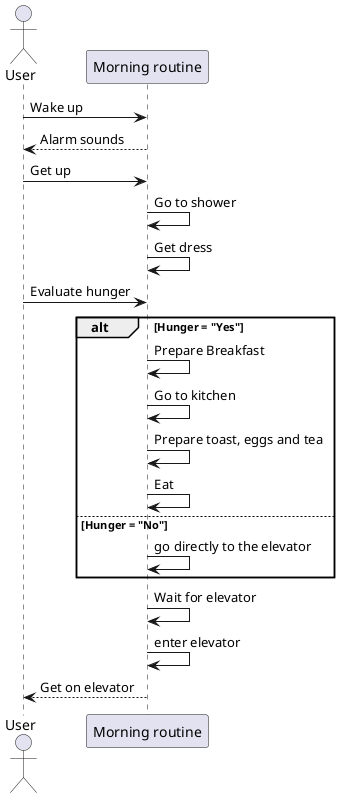

# First sequence diagram: Comunication between tasks

For the first sequence diagram, I will explain the interactions between my tasks. For instance, after finishing breakfast, I immediately start preparing my things for the university. This diagram will illustrate how these tasks communicate and transition from one to the next.

