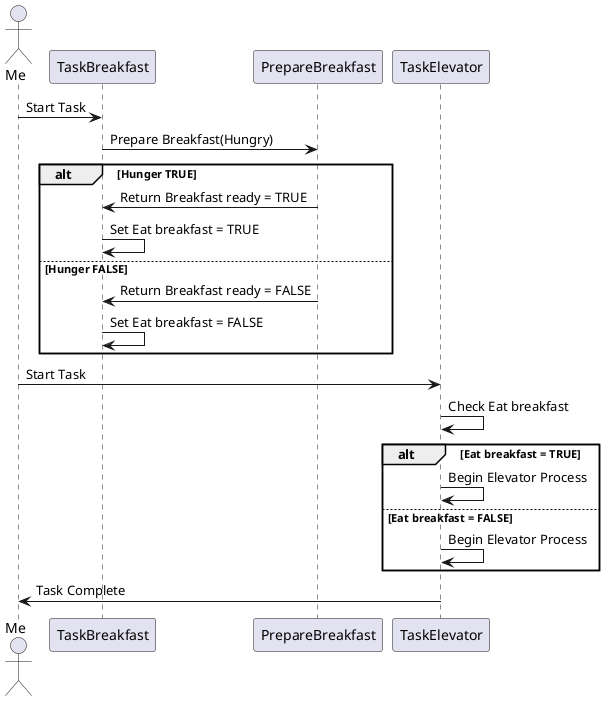

# Second sequence diagram: Calling the function

For the second sequence diagram, I will demonstrate how my tasks call specific functions to complete the process. For example, when having breakfast, I need to call a function "Prepare breakfast",heading to the university, I call functions like "Wait for the elevator" 

