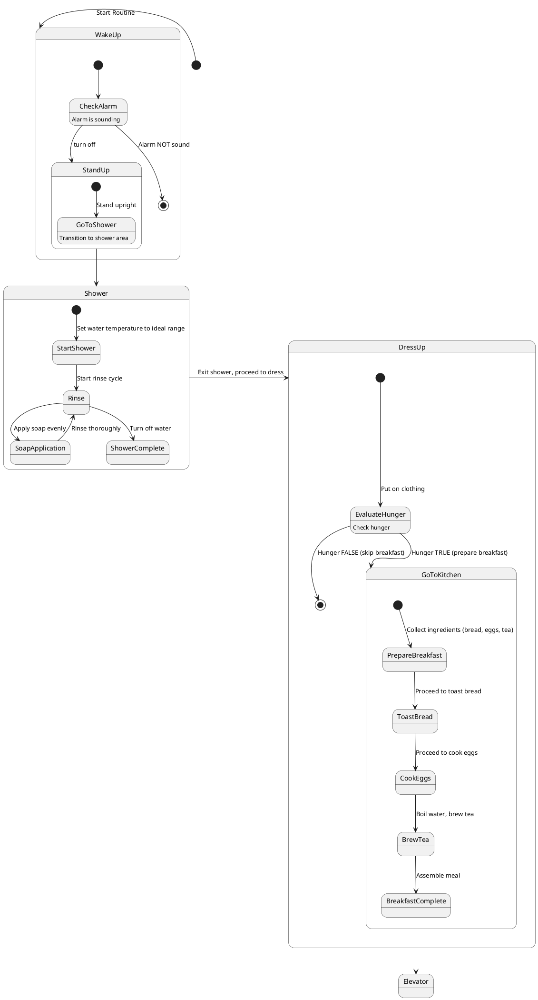

# First state diagram: Breakfast

My first task focuses on my morning routine when I get up take a shower and have breakfast. Typically, I eat bread with something and drink tea, so I will create a state diagram based on this. The process includes waking up, getting out of bed, taking a shower, and then having breakfast.

