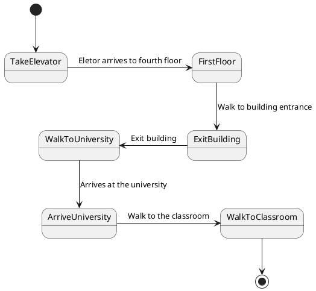

# Second state diagram: Going to university

The second task represents my routine after finishing breakfast and heading to the university. This state diagram outlines the process by taking the elevator, and then walking to the university.

